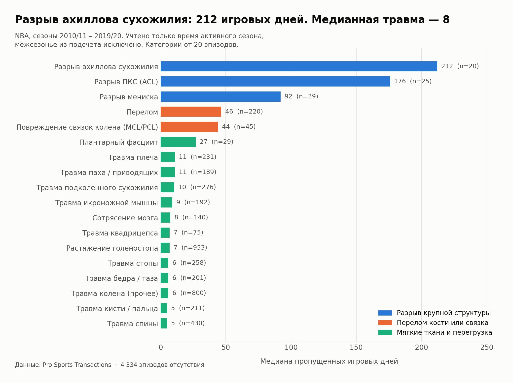
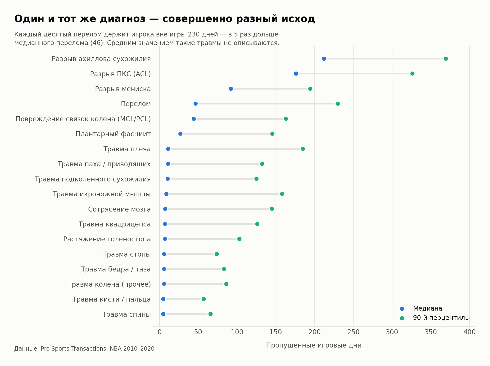
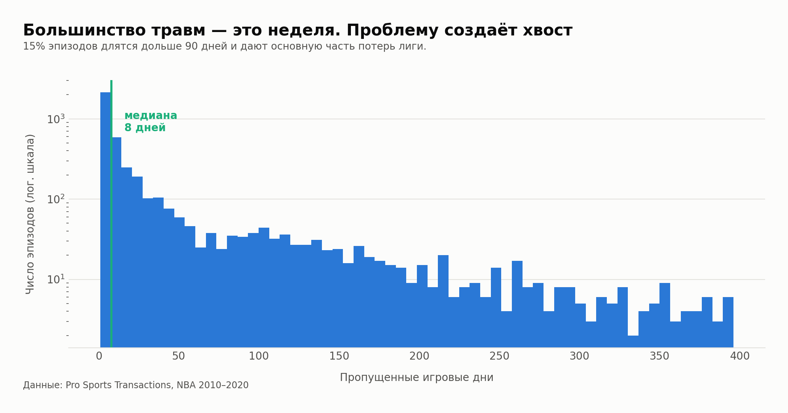

# Сколько игровых дней стоит травма в NBA

Анализ 8 867 эпизодов отсутствия игроков NBA за сезоны 2010/11 – 2019/20.
Открытые данные, воспроизводимый расчёт на Python.

«Игрок выбыл на неопределённый срок» — стандартная фраза спортивных новостей.
Разрыв ахиллова сухожилия и подвёрнутый голеностоп попадают под неё одинаково,
хотя различаются в тридцать раз. Здесь посчитано, во сколько именно.



## Что получилось

**Тяжесть идёт тремя ярусами, а не двумя.** Разрыв крупной структуры — ахиллово
сухожилие, ПКС, мениск — стоит 92–212 игровых дней. Перелом кости и повреждение связок
колена держатся на 44–46. Мягкие ткани и перегрузка укладываются в 5–27. Между первым
ярусом и вторым разрыв вдвое, между вторым и третьим — вчетверо.

**Неопределённость живёт в лёгких травмах, а не в тяжёлых.** У разрыва ахилла среднее
совпадает с медианой: порвал — выбыл примерно на год, вариантов мало. У травмы
квадрицепса среднее в 5,7 раза выше медианы — обычно неделя, но каждый десятый случай
тянется четыре месяца. Чем легче диагноз, тем хуже по нему строится прогноз. Отношение
среднего к медиане падает с 5,7 у мягких тканей до 1,0 у структурных повреждений.

**Хвост решает всё.** 14,5% эпизодов длятся дольше 90 дней и дают основную часть
суммарных потерь лиги. Средним такое распределение описывать нельзя.

**Диагноз задаёт не срок, а диапазон.** У перелома медиана 46 дней, а 90-й перцентиль —
230. Прогноз «вернётся через месяц» по одному названию травмы не строится.

| Травма | Эпизодов | Медиана, дней | 90-й перцентиль |
|---|---:|---:|---:|
| Разрыв ахиллова сухожилия | 20 | 212 | 369 |
| Разрыв ПКС (ACL) | 25 | 176 | 326 |
| Разрыв мениска | 39 | 92 | 194 |
| Перелом | 220 | 46 | 230 |
| Повреждение связок колена (MCL/PCL) | 45 | 44 | 163 |
| Плантарный фасциит | 29 | 27 | 145 |
| Травма плеча | 231 | 11 | 185 |
| Растяжение голеностопа | 953 | 7 | 103 |

Полная таблица — [`summary_by_injury.csv`](summary_by_injury.csv).



## Как это посчитано

Исходник — лог транзакций [Pro Sports Transactions](https://www.prosportstransactions.com/):
27 105 записей вида «игрок выбыл из состава» / «игрок вернулся в состав». Длительности
отсутствия в данных нет, диагнозов тоже — только свободный текст от пресс-службы клуба.

Расчёт в трёх шагах:

1. **Сборка эпизодов.** События склеиваются в пары по игроку: первое «выбыл» открывает
   эпизод, ближайшее «вернулся» закрывает. Повторные записи внутри эпизода дописывают
   описание, а не создают новый — реальная травма часто описана тремя строками подряд
   («day-to-day» → «placed on IL» → «surgery»).
2. **Только дни активного сезона.** Календарная разница завышает всё, что задевает
   межсезонье. Считаются только дни внутри окна 15 октября — 15 июня.
3. **Разметка по тексту.** Правила проверяются по порядку, первое совпадение выигрывает.
   Для ахилла дополнительно требуется признак разрыва (`torn`, `ruptur`, `surgery`),
   иначе тендинит и разрыв попадают в одну категорию. Каждая категория затем проверена
   на долю настоящих разрывов — см. раздел об ограничениях.

### Ошибка, которая чуть не попала в результат

Первым вариантом второго шага был фильтр «оставить только эпизоды внутри одного сезона».
Выглядит безобидно. На деле он выбросил 25 разрывов ахилла из 29 — именно потому, что
тяжёлая травма почти гарантированно захватывает лето. Медиана по четырём выжившим
составила 52 дня вместо 212.

Заметить это удалось только потому, что 52 дня на разрыв ахилла — очевидная чушь для
любого, кто знает предмет. Будь цифра правдоподобнее, она бы ушла в публикацию.
Разбор целиком — в [ноутбуке](analysis.ipynb).



## Чего эти данные не говорят

- **Это не диагнозы.** Формулировки писали пресс-службы клубов, а не врачи.
- **Дни, а не матчи.** Календарь игр не подключён, поэтому «230 дней» ≠ «140 пропущенных
  матчей». Следующий шаг работы.
- **Возвращение в состав ≠ восстановление.** Данные фиксируют выход на площадку, а не
  возврат к прежнему уровню игры.
- **Малые выборки.** У разрыва ахилла 20 эпизодов: порядок величины надёжен, точное
  число — нет.
- **Тяжесть распознаётся по тексту и различается не везде.** В категории «Повреждение
  связок колена» признак разрыва нашёлся лишь у 4 эпизодов из 45 — остальное растяжения,
  поэтому она названа повреждением, а не разрывом. У ахилла, мениска и ПКС разметка
  чистая: 20 из 20, 39 из 39 и 24 из 25.
- **Окно сезона фиксированное** (15.10 – 15.06), реальные даты плей-офф плавают.

## Файлы

| Файл | Что это |
|---|---|
| `analysis.ipynb` | весь разбор с выводом ячеек — главное здесь |
| `prepare.py` | сборка эпизодов из лога транзакций и разметка типов травм |
| `figures.py` | построение графиков |
| `injuries_2010-2020.csv` | исходные данные |
| `summary_by_injury.csv` | итоговая сводка по типам травм |

## Воспроизведение

```bash
git clone https://github.com/PonomaryovPavel/nba-injury-cost.git
cd nba-injury-cost
pip install -r requirements.txt
jupyter lab analysis.ipynb
```

## Данные

[Pro Sports Transactions](https://www.prosportstransactions.com/), собраны через
[gboogy/nba-injury-data-scraper](https://github.com/gboogy/nba-injury-data-scraper).
